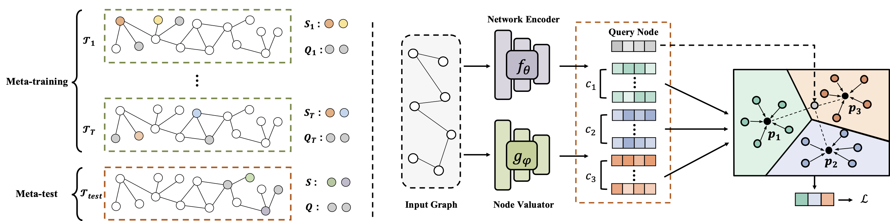

Graph Prototypical Networks for Few-shot Learning on Attributed Networks 
============

## Graph Prototypical Networks (GPN)

This is the source code of paper ["Graph Prototypical Networks for Few-shot Learning on Attributed Networks"](https://arxiv.org/pdf/2006.12739.pdf).


## Requirements
python==3.6.6 

torch==1.4.0

## Usage
```python train_gpn.py --shot 5 --way 5 --episodes 1000 --dataset dblp --dropout 0.5 --use_cuda```

Bạn có thể truy cập vào file ppt mà tôi đã trình bày để có thể hiểu hơn về dự án mà tôi đã thực hiện

Đây là kết quả sau khi tôi chạy file train.py và sử dụng dữ liệu Amazon


Bạn có thể truy cập vào file test.py để có thể thực hiện dự đoạn nhãn của dữ liệu có cấu trúc đồ thị.
Dưới đây là kết quả ví dụ sau thi tôi thực thi file test.py trên dữ liệu Amazon


